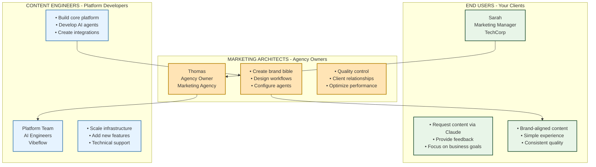
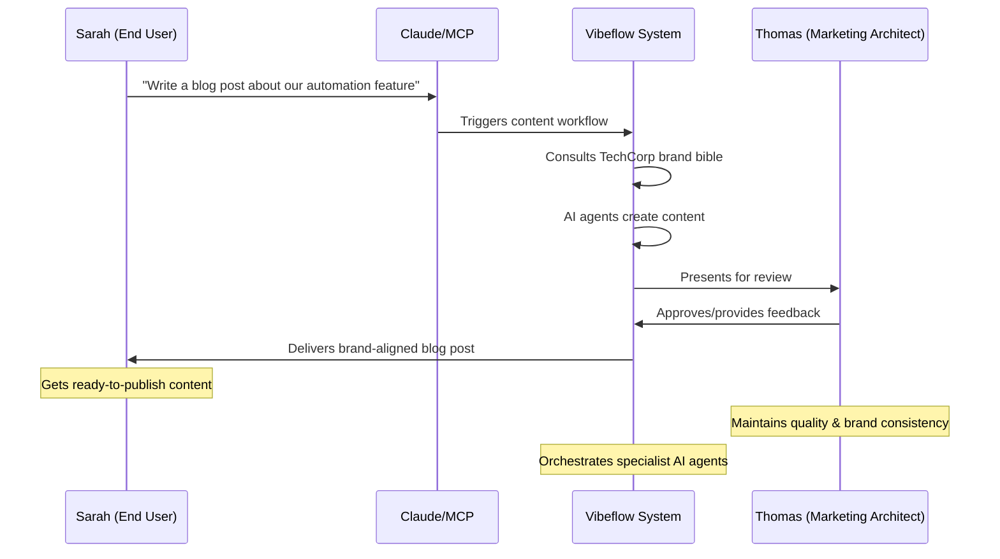
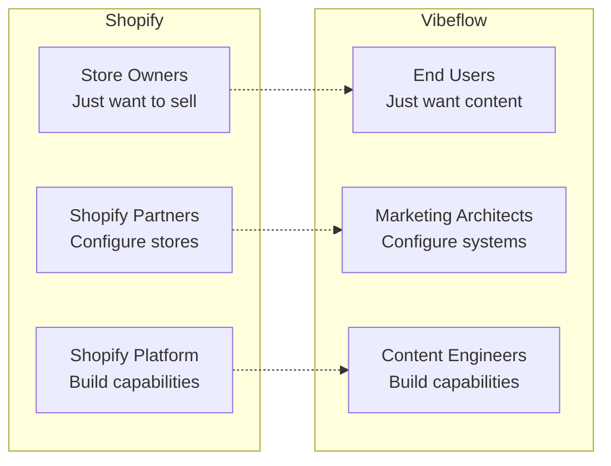

## Core Three-Tier System

```mermaid
graph TB
    %% Styling
    classDef endUser fill:#E8F5E8,stroke:#2D5A3D,stroke-width:2px
    classDef marketingArch fill:#FFE4B5,stroke:#B8860B,stroke-width:2px
    classDef contentEng fill:#E6F3FF,stroke:#4682B4,stroke-width:2px

    %% End User Tier
    subgraph EU ["END USERS - Your Clients"]
        SARAH["Sarah<br/>Marketing Manager<br/>TechCorp"]
        EU_DO["• Request content via Claude<br/>• Provide feedback<br/>• Focus on business goals"]
        EU_GET["• Brand-aligned content<br/>• Simple experience<br/>• Consistent quality"]
    end

    %% Marketing Architect Tier  
    subgraph MA ["MARKETING ARCHITECTS - Agency Owners"]
        THOMAS["Thomas<br/>Agency Owner<br/>Marketing Agency"]
        MA_SETUP["• Create brand bible<br/>• Design workflows<br/>• Configure agents"]
        MA_MANAGE["• Quality control<br/>• Client relationships<br/>• Optimize performance"]
    end

    %% Content Engineer Tier
    subgraph CE ["CONTENT ENGINEERS - Platform Developers"]
        PLATFORM["Platform Team<br/>AI Engineers<br/>Vibeflow"]
        CE_BUILD["• Build core platform<br/>• Develop AI agents<br/>• Create integrations"]
        CE_MAINTAIN["• Scale infrastructure<br/>• Add new features<br/>• Technical support"]
    end

    %% Connections
    SARAH --> THOMAS
    THOMAS --> PLATFORM
    
    MA_SETUP --> EU_GET
    CE_BUILD --> MA_SETUP
    
    %% Apply styles
    class SARAH,EU_DO,EU_GET endUser
    class THOMAS,MA_SETUP,MA_MANAGE marketingArch
    class PLATFORM,CE_BUILD,CE_MAINTAIN contentEng
```

## Real-World Example: Blog Post Creation

```mermaid
sequenceDiagram
    participant Sarah as Sarah (End User)
    participant Claude as Claude/MCP
    participant System as Vibeflow System
    participant Thomas as Thomas (Marketing Architect)
    
    Sarah->>Claude: "Write a blog post about our automation feature"
    Claude->>System: Triggers content workflow
    System->>System: Consults TechCorp brand bible
    System->>System: AI agents create content
    System->>Thomas: Presents for review
    Thomas->>System: Approves/provides feedback
    System->>Sarah: Delivers brand-aligned blog post
    
    Note over Sarah: Gets ready-to-publish content
    Note over Thomas: Maintains quality & brand consistency
    Note over System: Orchestrates specialist AI agents
```

## Shopify Model Comparison

```mermaid
graph LR
    subgraph Shopify
        S1["Store Owners<br/>Just want to sell"]
        S2["Shopify Partners<br/>Configure stores"]
        S3["Shopify Platform<br/>Build capabilities"]
    end
    
    subgraph Vibeflow
        V1["End Users<br/>Just want content"]
        V2["Marketing Architects<br/>Configure systems"]
        V3["Content Engineers<br/>Build capabilities"]
    end
    
    S1 -.-> V1
    S2 -.-> V2
    S3 -.-> V3
```
