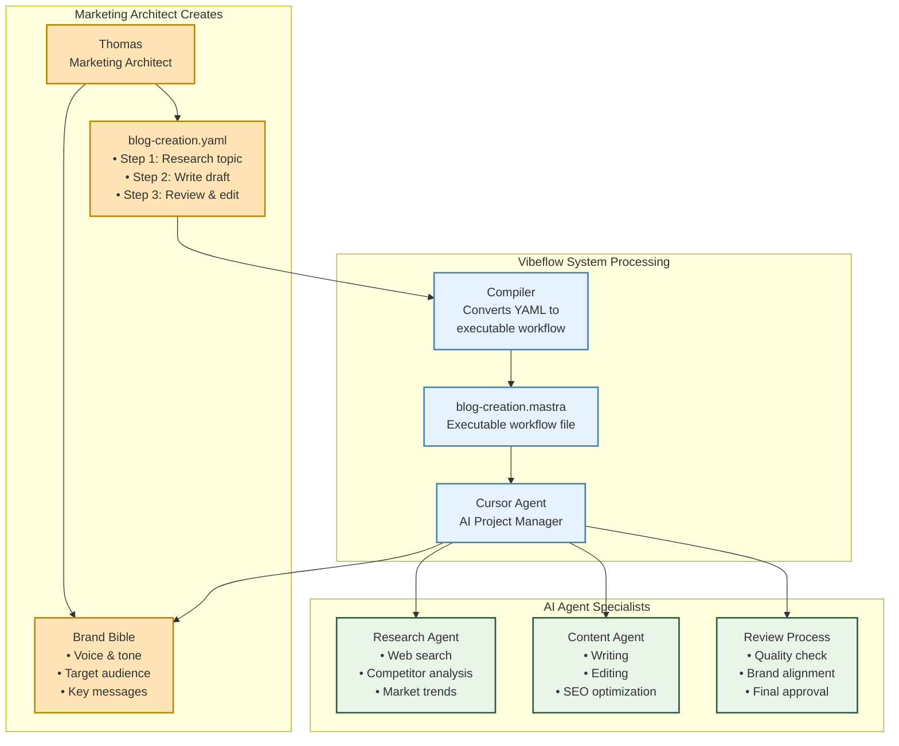
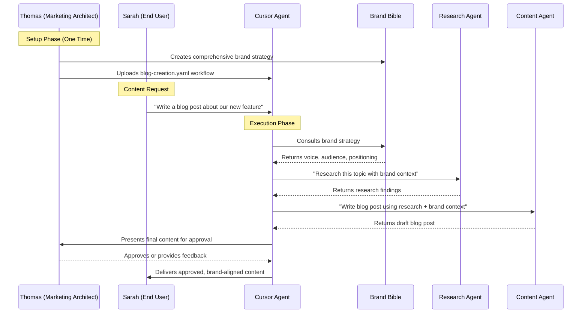
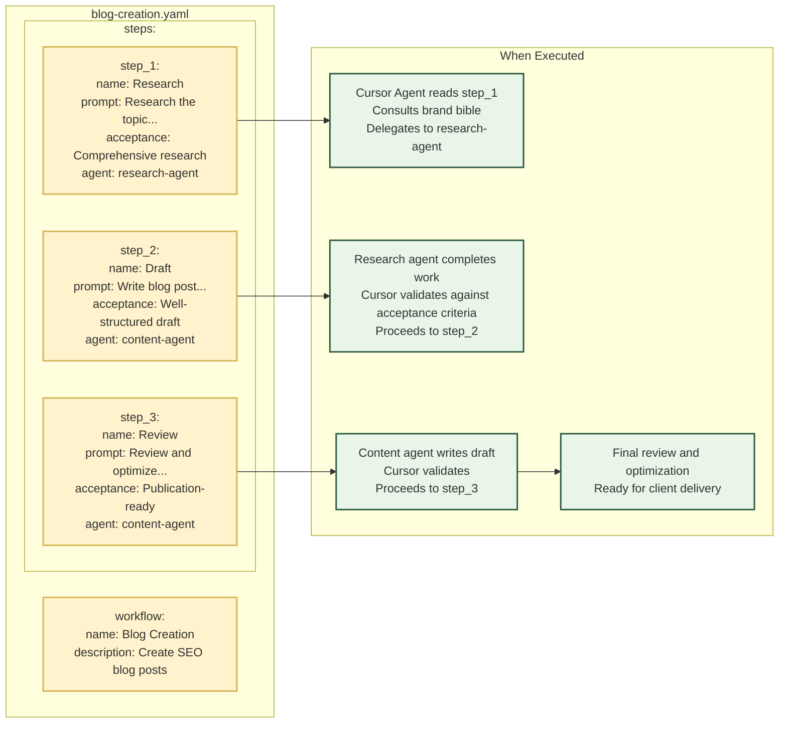

# How Workflows Work: From YAML to Execution

This diagram shows the complete journey of how Marketing Architects create workflows and how the Vibeflow system executes them.

## Workflow Creation & Compilation Process

## Real Workflow Execution Flow

## YAML Workflow Structure

## Key Insights for Marketing Architects

### Your Strategic Control Points
- **Brand Bible**: Your strategy drives every AI decision
- **YAML Workflows**: Your process design becomes automated execution
- **Quality Gates**: You define what "good enough" means at each step

### The Magic You Enable
- **For Clients**: Complex marketing processes feel like simple conversations
- **For Your Business**: Consistent, scalable, high-quality output
- **For AI Agents**: Clear instructions and brand context for perfect execution

### Why This Works
1. **Strategic Separation**: You focus on strategy, AI handles execution
2. **Brand Consistency**: Every output reflects your brand bible
3. **Quality Control**: Built-in review points ensure excellence
4. **Scalability**: One workflow serves unlimited content requests
