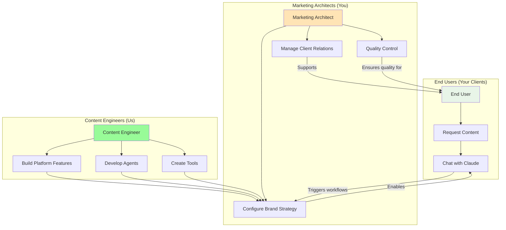
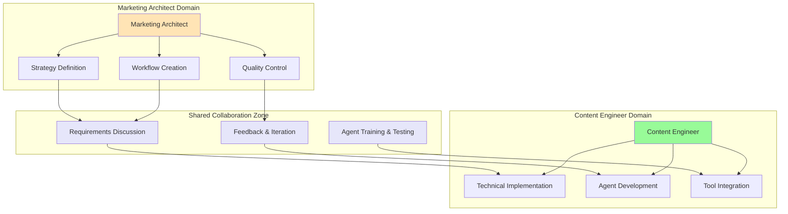

# Roles & Responsibilities

Vibeflow operates on a **three-tier system** similar to Shopify's model. Understanding these roles is crucial for effective collaboration and successful marketing automation.

📊 **[See the complete visual overview of the three-tier system](./diagrams/three-tier-system.md)**

## The Three-Tier System

### 🎯 **End Users** (Your Clients)
**They use Vibeflow daily to create content through natural conversation.**

#### What They Do
- Request content through Claude/MCP ("write a blog post about...")
- Provide feedback and iterate on AI-generated content
- Focus on their business goals, not system configuration
- Get brand-aligned content without technical knowledge

#### What They Don't Do
- Configure workflows or brand strategy
- Manage technical integrations
- Worry about system architecture
- Handle complex setup or troubleshooting

**Think of them like:** Shopify store owners who just want to sell products, not manage technical infrastructure.

### 🏗️ **Marketing Architects** (Agency Owners like Thomas)
**You are the strategic mind and client relationship manager.**

### Your Core Responsibilities

#### 🎯 Strategic Direction
- Define brand positioning and messaging for each client
- Create and maintain the brand bible (strategy documents)
- Set marketing goals and campaign objectives
- Make strategic decisions about content direction

#### 🔄 Workflow Design
- Design marketing processes as step-by-step workflows
- Define acceptance criteria for each workflow step
- Specify which agents should be used for different tasks
- Collaborate with the AI to refine workflow definitions

#### 🤝 Client Management
- Gather client requirements and brand guidelines
- Review and approve AI-generated content
- Provide feedback and direction to improve outputs
- Manage client expectations and deliverables

#### 📊 Quality Control
- Ensure all outputs align with brand guidelines
- Review agent work against acceptance criteria
- Make final decisions on content and strategy
- Maintain brand consistency across all touchpoints

### Your Typical Day

```mermaid
flowchart LR
    START[Start Day] --> REVIEW[Review Client Strategies]
    REVIEW --> PLAN[Plan Workflow Execution]
    PLAN --> EXECUTE[Run Workflows with AI]
    EXECUTE --> EVALUATE[Review Agent Outputs]
    EVALUATE --> APPROVE[Approve/Iterate Content]
    APPROVE --> DELIVER[Deliver to Client]
    DELIVER --> UPDATE[Update Brand Bible]
```

### What You Don't Do

- ❌ Build technical integrations
- ❌ Configure APIs or databases
- ❌ Write code or scripts
- ❌ Handle technical troubleshooting
- ❌ Create new agent capabilities

**Think of yourself like:** Shopify Partners who configure stores for clients, but don't build the core platform.

### ⚙️ **Content Engineers** (Platform Developers)
**We are the technical infrastructure team.**

### Our Core Responsibilities

#### 🔧 Technical Infrastructure
- Develop and maintain the Vibeflow platform
- Create new AI agents with specialized capabilities
- Build integrations with marketing tools and platforms
- Ensure system reliability and performance

#### 🤖 Agent Development
- Design agents for specific marketing functions
- Add new tools and capabilities to existing agents
- Optimize agent performance and accuracy
- Create agent templates for common use cases

#### 🛠 Tool Integration
- Connect Vibeflow to external marketing platforms
- Build custom tools for unique client needs
- Maintain API integrations and data flows
- Handle technical configuration and setup

#### 🚀 Platform Evolution
- Add new features based on user feedback
- Improve workflow execution capabilities
- Enhance the AI orchestration system
- Scale infrastructure for growing agencies

### Our Typical Projects

- Building a new Social Media Agent with advanced scheduling capabilities
- Creating integrations with CRM systems like HubSpot or Salesforce
- Developing custom analytics tools for campaign performance tracking
- Adding support for new content formats (video, interactive media)

### What We Don't Do

- ❌ Define client brand strategies
- ❌ Create marketing campaigns
- ❌ Make content decisions
- ❌ Manage client relationships
- ❌ Set strategic marketing direction

**Think of us like:** Shopify's core development team who build platform capabilities but don't manage individual stores.

## The Complete Flow

## How We Collaborate

### The Perfect Partnership

### End User Support Flow

**End Users contact Marketing Architects for:**
- Content that doesn't match expectations
- New content types or campaign needs
- Brand voice adjustments
- Strategic marketing questions

**Marketing Architects contact Content Engineers for:**
- New agent capabilities or tools
- Technical integrations with marketing platforms
- Platform bugs or performance issues
- Advanced workflow features

### When You Need Our Help

**Request new agent capabilities:**
"I need an agent that can analyze competitor pricing and generate pricing strategy recommendations."

**Ask for tool integrations:**
"Can we connect Vibeflow to our client's Mailchimp account for automated email campaign management?"

**Report workflow limitations:**
"The current social media workflow doesn't handle video content scheduling. Can we enhance this?"

### When We Need Your Input

**Understanding business requirements:**
"What specific metrics should this analytics agent track for your B2B clients?"

**Defining success criteria:**
"How should the content agent determine if a blog post meets your quality standards?"

**Brand context and examples:**
"Can you provide examples of 'on-brand' vs 'off-brand' content for this client?"

## Communication Protocols

### For Marketing Architects

#### When requesting new features:
1. **Describe the business need** - What client problem are you solving?
2. **Provide context** - What industry, client size, campaign type?
3. **Define success** - How will you know if this works?
4. **Share examples** - What would good output look like?

#### When reporting issues:
1. **Describe the workflow** - Which workflow and step?
2. **Expected vs actual** - What should have happened vs what did?
3. **Brand context** - Share relevant brand bible sections
4. **Client impact** - How does this affect client deliverables?

### For Content Engineers

#### When delivering new capabilities:
1. **Document new features** - Update agent and workflow documentation
2. **Provide examples** - Show how Marketing Architects should use this
3. **Test with real scenarios** - Use actual client brand bibles for testing
4. **Create tutorials** - Help Marketing Architects understand capabilities

## Success Metrics

### Marketing Architect Success
- Client satisfaction and retention
- Campaign performance improvements
- Time saved on content creation
- Brand consistency across all outputs
- Workflow efficiency gains

### Content Engineer Success
- System uptime and reliability
- Agent accuracy and performance
- Integration stability
- Feature adoption rates
- Platform scalability

## Growing Your Skills

### For Marketing Architects

**Workflow Design Mastery:**
- Learn to break complex campaigns into discrete steps
- Master acceptance criteria definition
- Understand agent capabilities and limitations

**Brand Bible Optimization:**
- Develop comprehensive brand documentation
- Create clear voice and tone guidelines
- Build effective content templates and examples

### For Content Engineers

**Agent Development:**
- Study marketing automation best practices
- Understand brand consistency requirements
- Learn from Marketing Architect feedback

**Integration Strategy:**
- Map the marketing technology landscape
- Understand data flow requirements
- Build for scalability and reliability

---

*Understanding your role is just the beginning. Next, learn [how the system architecture works](./system-architecture.md) to better leverage Vibeflow's capabilities.*
