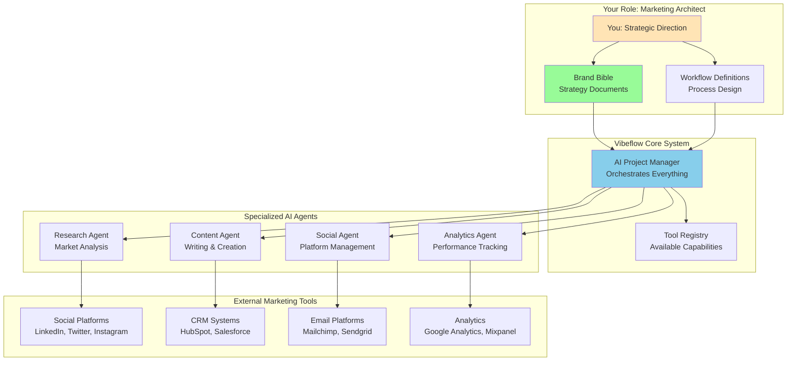
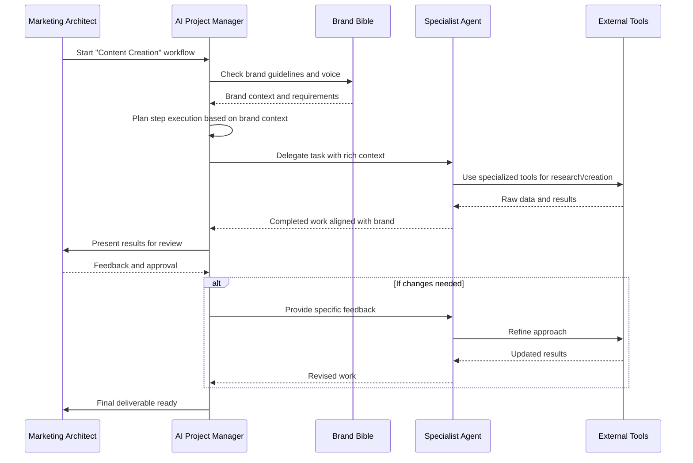

# System Architecture

Understanding how Vibeflow works under the hood will help you make better decisions about workflows, agents, and client strategy. Don't worry - we'll explain everything in marketing terms, not technical jargon.

## The Big Picture

Think of Vibeflow as your marketing agency's nervous system. It connects your strategic brain (the brand bible) to specialized team members (agents) who execute tasks, all coordinated by an intelligent project manager (the Cursor Agent).



## Core Components Explained

### The AI Project Manager (Your Digital Campaign Manager)

The **Cursor Agent** is like hiring the world's best campaign manager who:

- **Never forgets your brand guidelines** - Always references your brand bible before making decisions
- **Coordinates your team perfectly** - Knows which specialist to assign to each task
- **Asks the right questions** - When information is missing, asks you instead of guessing
- **Maintains quality control** - Reviews all work against your acceptance criteria
- **Learns from feedback** - Incorporates your input to improve future performance

**What this means for you:**
You get consistent, brand-aligned work without micromanaging every detail. The AI handles coordination while you focus on strategy and client relationships.

### Your Brand Bible (The Strategic Foundation)

Your `strategy/` folder contains markdown files that serve as your brand's constitution. Every AI decision flows from these documents.

**Why this matters:**
- **Consistency**: All content sounds like it comes from the same brand voice
- **Scalability**: New team members (human or AI) instantly understand your brand
- **Quality**: No more off-brand content slipping through
- **Efficiency**: Less time explaining brand guidelines repeatedly

**Example Structure:**
```
strategy/
├── brand-positioning.md    # Who you are, what you stand for
├── target-audience.md      # Who you're talking to
├── voice-messaging.md      # How you communicate
├── content-pillars.md      # What topics you focus on
├── campaign-calendar.md    # Seasonal and recurring themes
└── competitor-landscape.md # Market positioning context
```

### Workflows (Your Marketing Playbooks)

Workflows transform your marketing processes into step-by-step instructions that AI can execute consistently.

**Think of workflows like:**
- **Recipes** - Specific ingredients and steps for repeatable results
- **Playbooks** - Proven processes that work every time
- **Standard Operating Procedures** - How your agency does things

**Workflow Components:**

1. **Steps** - Individual tasks in sequence
2. **Instructions** - Clear direction for the AI project manager
3. **Acceptance Criteria** - How to know if the step is complete
4. **Agent References** - Which specialists to use

```yaml
# Example: Content Creation Workflow
name: "Blog Post Creation"
description: "Create SEO-optimized blog posts aligned with brand voice"

steps:
  - name: "Research Phase"
    instructions: "Research the topic and identify key trends"
    acceptance_criteria: "Three credible sources and trend analysis"
    agents: ["research-agent"]
    
  - name: "Content Creation"
    instructions: "Write blog post using research and brand guidelines"
    acceptance_criteria: "1500 words, SEO optimized, on-brand voice"
    agents: ["content-agent"]
```

### Specialized Agents (Your Expert Team)

Each agent is like hiring a specialist with specific skills and tools.

#### Research Agent
**What they do:**
- Market analysis and competitive research
- Trend identification and opportunity mapping
- Audience research and persona development
- Performance benchmarking

**Tools they use:**
- Web search and content analysis
- Social media monitoring tools
- Industry databases and reports
- Competitor analysis platforms

#### Content Agent
**What they do:**
- Blog posts, social content, and email copy
- SEO optimization and keyword integration
- Brand voice adaptation for different channels
- Content editing and proofreading

**Tools they use:**
- Writing and editing software
- SEO analysis tools
- Grammar and style checkers
- Content optimization platforms

#### Social Media Agent
**What they do:**
- Platform-specific content adaptation
- Posting schedule optimization
- Engagement monitoring and response
- Hashtag and trend analysis

**Tools they use:**
- Social media management platforms
- Scheduling and automation tools
- Analytics and monitoring systems
- Community management interfaces

#### Analytics Agent
**What they do:**
- Campaign performance tracking
- ROI analysis and reporting
- A/B testing setup and analysis
- Data visualization and insights

**Tools they use:**
- Google Analytics and similar platforms
- Social media analytics
- Email marketing metrics
- CRM integration and reporting

## How Everything Works Together

### The Workflow Execution Process



### Decision-Making Framework

The AI Project Manager follows a strict decision-making process:

1. **Consult Brand Bible First** - Every decision starts with your strategy documents
2. **Check for Missing Information** - If context is unclear, ask you instead of guessing
3. **Select Right Specialists** - Choose agents based on task requirements
4. **Provide Rich Context** - Brief agents with comprehensive brand information
5. **Quality Control** - Review outputs against acceptance criteria
6. **Iterate Based on Feedback** - Incorporate your input to improve results

### Multi-Client Architecture

For agencies managing multiple clients, each client gets their own isolated environment:

```
your-agency-name/
├── client-tech-startup/
│   ├── strategy/           # Tech startup brand bible
│   ├── workflows/          # SaaS-focused workflows
│   └── outputs/           # Generated content
├── client-ecommerce/
│   ├── strategy/           # E-commerce brand bible
│   ├── workflows/          # Retail-focused workflows
│   └── outputs/           # Generated content
└── agency-internal/
    ├── strategy/           # Your agency's brand
    ├── workflows/          # Business development workflows
    └── outputs/           # Your own marketing content
```

**Benefits:**
- **Complete Isolation** - No cross-contamination between client brands
- **Customized Agents** - Each client can have specialized agent configurations
- **Individual Reporting** - Separate analytics and performance tracking
- **Scalable Structure** - Add new clients without affecting existing ones

## Technical Protocols (Simplified)

### MCP (Model Context Protocol)
**What it is:** A standardized way for AI agents to access tools and services
**What it means for you:** Agents can connect to any marketing tool that supports this protocol
**Your benefit:** More integrations available with less technical complexity

### A2A (Agent-to-Agent Communication)
**What it is:** How specialist agents share information and coordinate work
**What it means for you:** Research findings automatically inform content creation
**Your benefit:** Better collaboration between specialists without your intervention

### Version Control & Rollback
**What it is:** Your brand bible and workflows are tracked like software code
**What it means for you:** You can safely experiment and revert if something doesn't work
**Your benefit:** Confidence to iterate and improve without fear of losing what works

## Performance & Scalability

### How Vibeflow Scales with Your Agency

**Small Agency (1-5 clients):**
- Single Vibeflow instance with multiple client directories
- Shared agent configurations with client-specific brand bibles
- Manual workflow execution and review

**Medium Agency (5-20 clients):**
- Dedicated instances for complex clients
- Custom agent configurations for different industries
- Automated workflow scheduling and execution

**Large Agency (20+ clients):**
- Enterprise-grade infrastructure with team collaboration
- Industry-specific agent templates and workflows
- Advanced analytics and performance optimization

---

*Now that you understand how Vibeflow works, learn how to [create and manage workflows](./workflows-guide.md) for your clients.*
