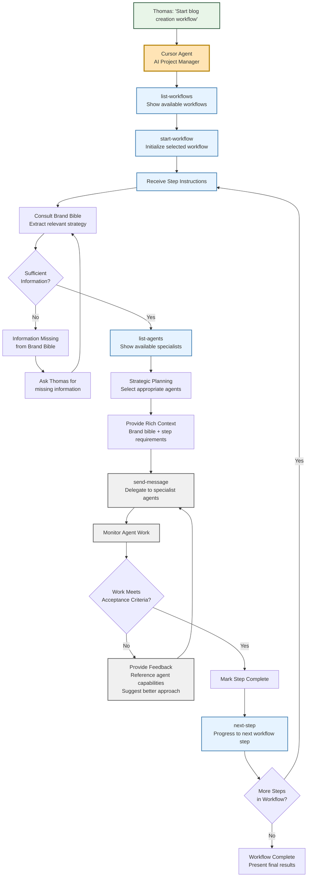
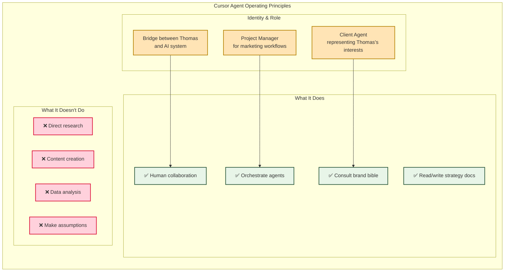
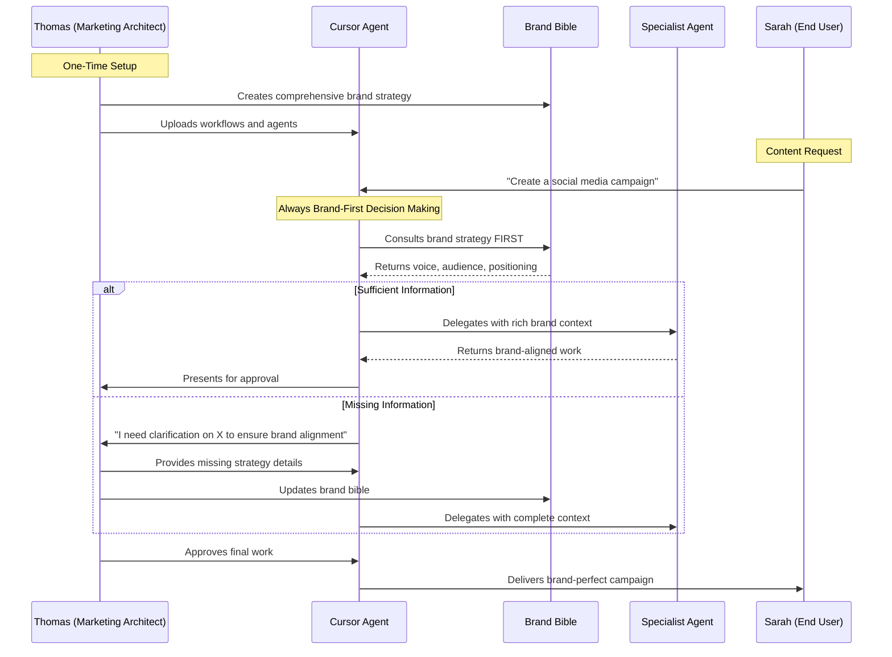
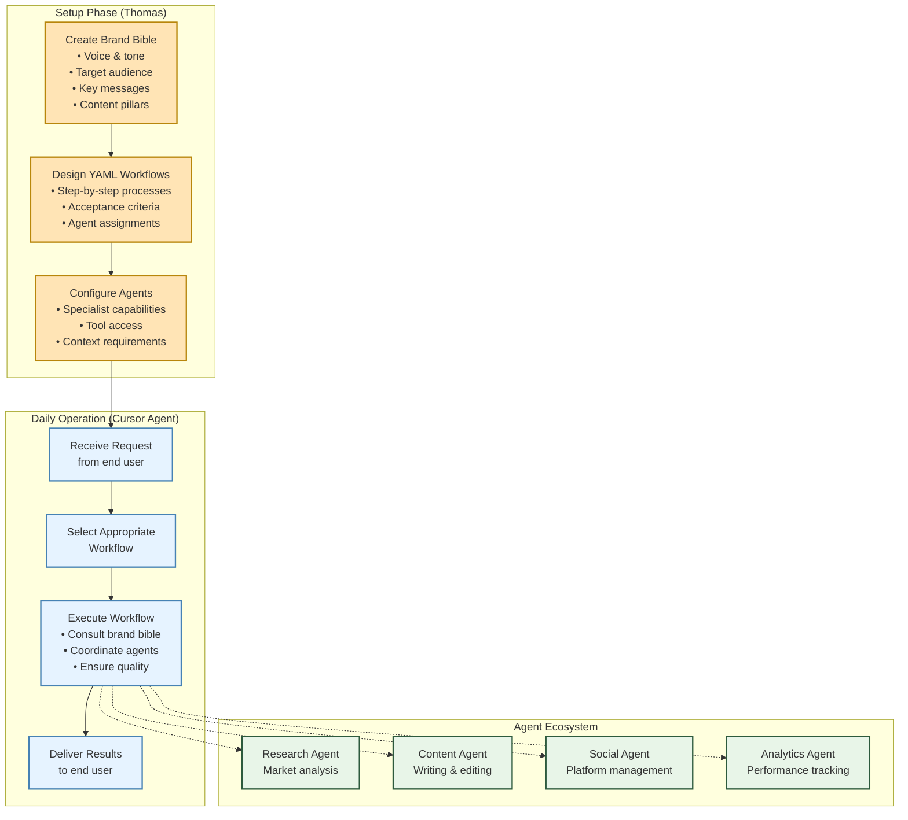

# The Cursor Agent: Your AI Project Manager

This diagram shows how the Cursor Agent operates as your dedicated client agent, acting as the bridge between your strategic vision and AI execution.

## Cursor Agent Decision-Making Process

## The Cursor Agent's Core Principles

## Brand Bible as Decision Driver

## Workflow Management Lifecycle

## Key Insights for Marketing Architects

### Your Strategic Control
- **Brand Bible Drives Everything**: Every AI decision flows from your strategy documents
- **Workflow Design**: Your process design becomes automated execution
- **Quality Gates**: You define acceptance criteria that the Cursor Agent enforces

### The Cursor Agent's Value
- **Never Makes Assumptions**: Always asks when information is missing
- **Brand-First Decisions**: Consults your strategy before every action
- **Context-Rich Delegation**: Provides agents with comprehensive brand context
- **Quality Assurance**: Validates all work against your acceptance criteria

### Why This Architecture Works
1. **Strategic Separation**: You focus on strategy, AI handles tactical execution
2. **Consistent Quality**: Your brand bible ensures every output is on-brand
3. **Scalable Oversight**: One workflow serves unlimited requests with consistent quality
4. **Human Control**: You maintain final approval while automating the heavy lifting
